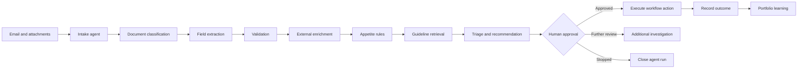

# Ledgebrook Submission Intelligence Agent

**AI interprets. Automation executes. Underwriters decide.**

Synthetic prototype that turns unstructured wholesale insurance submissions into decision-ready underwriting cases.

> The agent prepares and recommends. The underwriter remains accountable.

> The agent prepares the work; it does not own the risk.

**Disclaimer:** All data and integrations are fictional/simulated. This prototype does **not** connect to Ledgebrook production systems and does **not** claim legal or regulatory compliance.

---

## Business problem

Wholesale submissions arrive as inconsistent broker emails and attachments (ACORD, loss runs, SOVs, spreadsheets, PDFs). Underwriters manually open files, re-key data, check appetite, search guidelines, and decide whether to decline, refer, request information, or quote — often across multiple systems.

## Agent purpose

Convert an unstructured submission into a structured, cited, auditable underwriting case with a transparent recommendation — then execute **only approved** workflow actions in simulated downstream systems.

The goal is **decision-ready underwriting, not autonomous underwriting**.

---

## Architecture

| Layer | Technology |
|-------|------------|
| Agent runtime | Python state graph (LangGraph-compatible; swap-ready) |
| API | FastAPI + Pydantic |
| Persistence | SQLite |
| Guidelines | Local keyword RAG over approved JSON passages |
| Model provider | Deterministic `mock` (Bedrock/Anthropic/OpenAI/Azure/local stubs) |
| Operator console | Next.js |
| Tests | pytest |
| Packaging | Docker Compose |

### State machine



Every node reads/writes shared `AgentState` (product, fields with provenance, contradictions, appetite, guidelines, priority, recommendation, approvals, audit events).

### Tools

Formal registry with name, schemas, permission level, approval flag, timeout, retry, audit:

- `read_submission_email`
- `classify_document`
- `extract_insurance_fields`
- `lookup_broker_profile`
- `lookup_company_enrichment`
- `evaluate_appetite`
- `retrieve_underwriting_guidance`
- `calculate_priority_score`
- `create_socotra_submission` *(simulated)*
- `draft_broker_email` *(draft only — never auto-sends)*
- `record_human_decision`
- `record_outcome`

### Memory

1. **Working** — current submission state  
2. **Episodic** — prior runs, recommendations, overrides, outcomes (never treated as facts about a new insured)  
3. **Semantic** — guidelines, appetite rules, procedures  

### Human approval gates

Required before decline communication, referral conclusion, quote progression, core-system update, and external communication. Overrides require a reason.

### AI versus automation

| Capability | Mechanism |
|------------|-----------|
| Interpretation | Deterministic parsers + mock classifier observations |
| Appetite / authority | Hard rules (separate from AI observations) |
| Guidelines | Cited retrieval only; abstains without evidence |
| Priority | Transparent weighted scorecard (no black box) |
| Execution | Workflow automation **after** human approval |

Key product lines:

- Every extracted fact has a source.
- Every material action has an accountable human.
- Faster intake is useful. Better portfolio decisions create lasting advantage.
- Every underwriting decision should improve the next one.

---

## Responsible AI controls

- Use-case classified as **high risk** (underwriting decision support)
- Confidence thresholds + human routing for low-confidence critical fields
- Deterministic validation and contradiction detection
- Protected-class features blocked from appetite scoring; fairness-test placeholder included
- Explainability: factors, rules, evidence, citations, confidence
- Prompt-injection detection, file validation, audit logging
- Vendor governance page (provider, retention, training-data policy, region, version)
- Monitoring metrics endpoint (acceptance, overrides, abstention, processing time)

Conceptual references only: NAIC Model Bulletin on AI Systems, NIST AI RMF, human-in-the-loop controls. **No compliance claim.**

---

## Setup

```bash
# Python API
python3 -m venv .venv
source .venv/bin/activate
pip install -r requirements.txt
cp .env.example .env

# UI
npm install
```

## Local execution

Terminal 1 — agent API:

```bash
source .venv/bin/activate
uvicorn api.main:app --reload --host 0.0.0.0 --port 8000
```

Terminal 2 — operator console:

```bash
npm run dev
```

Open [http://localhost:3000](http://localhost:3000).

Docker:

```bash
docker compose up --build
```

## Test execution

```bash
source .venv/bin/activate
pytest -v
```

## Demo scenarios (≈5 minutes)

1. Open **Demo Scenarios** and start **Scenario 1: Clean fast-track**.
2. Watch the plan, tool calls, and timeline on the agent run page.
3. Review extracted fields (with sources), appetite hard rules vs AI observations, guideline citations, and priority scorecard.
4. **Approve** the recommendation (or override with a reason).
5. Confirm simulated Socotra update / drafted broker email.
6. Record a downstream outcome.
7. Read the learning insight (no auto-retrain).

| Scenario | Expected recommendation |
|----------|-------------------------|
| 1 Clean fast-track | `fast_track` |
| 2 Missing information | `request_information` |
| 3 Authority referral | `refer_senior` |
| 4 Out of appetite | `decline_recommend` |
| 5 AI uncertainty | `human_review_uncertain` |
| 6 Human override | `standard_review` → override → learning insight |

## Simulated Socotra integration

`create_socotra_submission` writes an idempotent in-memory/simulated record (`SOC-…`). It is labeled simulated, reversible where flagged, and never touches a real policy admin system.

## Future Bedrock / platform integration

Provider stubs exist for Amazon Bedrock, Anthropic, OpenAI, Azure OpenAI, and local models (`agent/providers.py`). Set `MODEL_PROVIDER` when wiring credentials. Roadmap hooks: Outlook/Gmail intake, Textract/Sensible, live Socotra, Federato, Snowflake/dbt, claims/billing/reinsurance, broker portal, model monitoring, production IAM.

On Python 3.10+, install `langgraph` and set `GRAPH_BACKEND=langgraph` to swap the local graph runner.

## Current limitations

- Deterministic mock model (not generative LLM reasoning)
- Keyword guideline retrieval (not dense embeddings)
- SQLite local store
- No real email send, bind, pricing, or production IAM
- Operator UI is intentionally minimal relative to the agent

## API

```
POST   /submissions
GET    /submissions
GET    /submissions/{id}
POST   /submissions/from-scenario/{scenario_id}
POST   /submissions/{id}/run
POST   /submissions/{id}/pause
POST   /submissions/{id}/resume
POST   /submissions/{id}/approve
POST   /submissions/{id}/override
POST   /submissions/{id}/investigate
POST   /submissions/{id}/outcome
GET    /submissions/{id}/events
GET    /agent/metrics
GET    /agent/use-cases
GET    /agent/governance
GET    /scenarios
```

## Project layout

```text
agent/          graph, state, planner, policies, nodes
tools/          registered simulated tools
models/         Pydantic domain models
data/           synthetic submissions, guidelines, appetite, brokers
api/            FastAPI app + SQLite
src/            Next.js operator console
tests/          unit + end-to-end agent tests
```

## Synthetic-data disclaimer

Independent concept prototype using fictional brokers, insureds, guidelines, and system IDs. Not affiliated with production Ledgebrook systems, carriers, or brokers.
